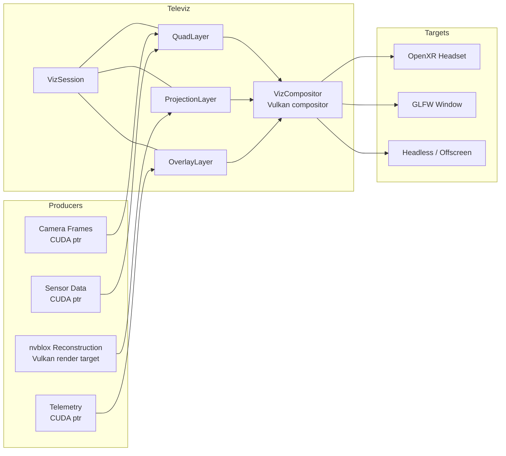
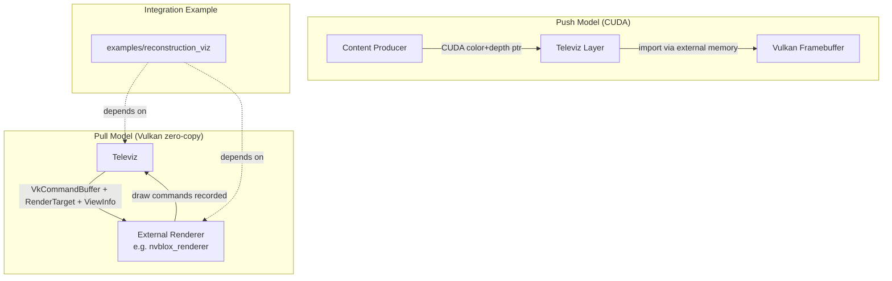

# Televiz — Teleop Visualization Renderer

**Author:** Farbod Motlagh
**Status:** Draft
**Created:** April 2026

---

## Objective

Isaac Teleop needs a rendering module that composites robot sensor data into
XR and windowed displays for teleoperation. Current we are providing a
Holoscan-based camera streaming app that depends on the full Holoscan SDK,
HoloHub XR operators, and HolovizOp, a heavy chain of dependecies for what is
fundamentally compositing textured quads and RGBD buffers.

Televiz replaces this with a lightweight, self-contained C++ module
(with Python bindings) that:

1. **Renders 2D sensor data as planes in 2D or 3D space** — camera feeds,
   sensor data, or any 2D content tiled on a monitor or placed at arbitrary
   poses in XR (world-locked, head-locked, lazy-locked).

2. **Renders RGBD projection views** — stereo color+depth from external
   renderers (e.g. nvblox 3D reconstruction) composited with correct depth
   relationships alongside 2D planes.

3. **Outputs to OpenXR, windowed displays, or potentially a web client** —
   same layer API, different display target.

4. **Integrates with IsaacTeleop** at the application level alongside
   TeleopSession for device tracking and retargeting.

### Why not use an existing library?

No third-party library provides the combination we need: OpenXR swapchain
management with CUDA-Vulkan interop and simple 2D/3D tensor submission APIs.


## Goals

- C++ core with Python bindings for compositing 2D textures and RGBD content
  into XR and windowed displays.
- Self-contained Vulkan infrastructure — no shared code dependency on
  nvblox_renderer, Holoscan, or HoloHub.
- Zero-copy integration with external renderers via Vulkan render targets.
- Expose XR runtime info (resolution, FOV, frame timing, view poses) to
  content producers.
- Reference examples: multi-camera plane streaming and 3D reconstruction
  visualization.

## Non-Goals

- Camera capture and network streaming (GStreamer, StreamSDK, V4L2 remain
  separate — Televiz consumes frames, it does not produce or transport them).
- Retargeting, device I/O, or teleop session management (remain in Isaac
  Teleop Core).
- General-purpose rendering engine (no lighting, shadows, PBR, scene graphs).
  Complex 3D content is rendered by external engines and submitted as a layer.

### Why not keep Holoscan?

Holoscan SDK + HoloHub XR + GXF + HolovizOp + EventBasedScheduler is ~5
heavyweight dependencies for rendering textured quads. Televiz is
~3,000-3,500 lines of purpose-built C++ with no external framework dependency.

---

## Architecture

Televiz sits between content producers (cameras, reconstruction engines)
and display targets (OpenXR headsets, monitor windows). It is a compositor,
not a rendering engine — it assembles content from multiple sources into a
final frame.



Effectively, Televiz repackages the same OpenXR + Vulkan + CUDA interop
patterns used by HoloHub's XR operators into a standalone library with a
simple frame-loop API — no Holoscan operator graph, no GXF, no external
framework dependencies.

---

## Core Concepts

### VizSession

The central object. Manages the Vulkan context, OpenXR session (if XR mode),
display target, and layer registry. Applications interact through a frame
loop:

```python
session = isaacteleop.viz.VizSession.create(config)  # XR, window, or offscreen

# Push: submit content as CUDA pointers.
cam_layer = session.add_layer(viz.QuadLayer.Config(...))

# Pull: register a callback that receives a Vulkan render target.
recon_layer = session.add_layer(viz.ProjectionLayer.Config(...))
recon_layer.set_render_callback(my_nvblox_render_fn)

while running:
    cam_layer.submit(camera_frame)  # CuPy array or VizBuffer
    session.render()                 # wait + composite + present
```

### FrameInfo

Returned by `render()` (and `begin_frame()`). Provides per-frame state that
content producers need: per-eye view/projection matrices, FOV, predicted
display time, and a `should_render` flag. In windowed mode, synthetic
values are provided.

### Layers

Content is submitted through typed layers. Each layer has a name, priority
(draw order), and visibility toggle. Layers are double-buffered — producers
write at their own rate, the renderer reads the latest content at display
frame rate.

---

## Layer Types

### QuadLayer

A 2D texture placed in space. Accepts a CUDA device pointer for the image
content and a 3D pose for placement.

- **Placement modes:** world-locked (fixed position), head-locked (follows
  headset, HUD-style), lazy-locked (follows headset with damping).
- **Stale content:** if no new frame arrives within a timeout, a placeholder
  is displayed.
- **Windowed mode:** planes are tiled as 2D rectangles in the window.

Use cases: camera feeds, depth maps, sensor visualizations.

### ProjectionLayer

A full stereo RGBD view. Accepts per-eye color + depth either as CUDA buffers
(push) or via a Vulkan render target that an external renderer draws into
(pull). See Push vs Pull below.

Use cases: nvblox 3D reconstruction, depth-enhanced camera views.

### OverlayLayer

A 2D texture composited in screen space after all world-space content. No
depth testing.

Use cases: telemetry HUD, connection status, battery indicators.

---

## Push vs Pull (External Renderer Integration)

Televiz supports two models for getting content into layers.

**Push model:** The producer renders independently and submits CUDA color +
depth buffers to Televiz. One copy (CUDA to Vulkan import). Good for
async/remote sources.

**Pull model:** Expressed via a custom `LayerBase` subclass. The subclass
overrides `record(VkCommandBuffer, views, RenderTarget)` and draws directly
into Televiz's framebuffer — zero copy. Good for nvblox_renderer and other
local Vulkan renderers.

For the pull model, both libraries remain independent — Televiz owns its
Vulkan infrastructure, the external renderer owns its own. The integration
point is the `VkCommandBuffer`: Televiz provides it, the external renderer
records draw commands into it. The example application wires them together.



---

## Session Ownership

### The Problem

IsaacTeleop's OXR module currently creates a **headless** OpenXR session for
device tracking (hand tracking, headset pose). It has no Vulkan device and
cannot submit frames. Televiz needs a **graphics-bound** session with
Vulkan for rendering.

### Options

| Option | Description | Pros | Cons |
|--------|-------------|------|------|
| **A: Separate sessions** | Televiz creates its own graphics session. OXR module keeps its headless session. | No changes to existing code. Works today. | Two CloudXR connections. |
| **B: Televiz owns, trackers attach** | Televiz creates the session. Trackers from TeleopSession attach to it via `oxr_handles`. | Single session/connection. | Requires TeleopSession to accept Televiz's handles. |
| **C: Extended OXR module** | OXR module optionally creates a graphics-bound session and passes Vulkan handles to Televiz. | OXR retains ownership. | Requires OXR module changes. |

### Recommendation

Start with **Option A** — zero changes to existing modules, immediate
development. Migrate to **Option B** once stable, using TeleopSession's
existing `oxr_handles` config to pass Televiz's session to device trackers.
This gives a single CloudXR connection with no TeleopSession code changes.

---

## IsaacTeleop Integration

Televiz is packaged as `isaacteleop.viz`, following the convention of
`isaacteleop.oxr`, `isaacteleop.mcap`, `isaacteleop.schema`.

It integrates at the **application level** alongside `TeleopSession` — not
inside it. TeleopSession manages device tracking and retargeting;
Televiz manages rendering. Both run in the same loop:

```python
import isaacteleop.viz as viz
from isaacteleop import TeleopSession, TeleopSessionConfig

viz_session = viz.VizSession.create(viz.Config(mode=viz.DisplayMode.XR))
cam_layer = viz_session.add_layer(viz.QuadLayer.Config(name="front_cam", ...))

teleop_config = TeleopSessionConfig(app_name="teleop", pipeline=pipeline)
with TeleopSession(teleop_config) as teleop:
    while running:
        teleop.step()
        cam_layer.submit(camera_frame)   # CuPy array or VizBuffer
        viz_session.render()
```

In the future unified-session mode (Option B), Televiz can pass its
graphics-bound session to TeleopSession via the existing `oxr_handles`
config — no TeleopSession changes needed:

```python
teleop_config = TeleopSessionConfig(
    pipeline=pipeline,
    oxr_handles=viz_session.get_oxr_handles(),
)
```

---

## Rendering Strategy: Single Render Pass vs Quad Layers

### Single Render Pass (recommended)

All layers are composited into one stereo framebuffer, submitted as a single
`XrCompositionLayerProjection` with depth info. Televiz renders textured
quads (planes) and blits RGBD content (projection layers) in one Vulkan
render pass, with depth testing for correct occlusion between 2D planes and
3D content.

**Pros:** Unlimited layers. Correct depth compositing. Full control.
**Cons:** No per-layer runtime reprojection.

### OpenXR Quad Layers (alternative)

Each `QuadLayer` maps to an `XrCompositionLayerQuad`. Each
`ProjectionLayer` maps to an `XrCompositionLayerProjection`. The runtime
composites them.

**Pros:** Simpler renderer. Per-layer reprojection by the runtime.
**Cons:** Layer count limit (~16). No depth compositing between layers —
cannot correctly embed 2D planes in 3D space.

### Recommendation

Single render pass as the primary path. It is the only approach that supports
combining 2D planes with 3D reconstruction and correct depth relationships.
Quad layers can be used as an optimization for head-locked overlays in the
future.

---

## XR Runtime Information

Content producers need to know what resolution, FOV, and timing to target.
Televiz exposes this at two levels:

**Session-level (stable after init):** recommended per-eye resolution, view
count, display refresh rate. Used at startup to allocate buffers.

**Per-frame (from `FrameInfo`):** per-eye pose, FOV, view-projection
matrices, predicted display time, `should_render` flag. Used each frame for
rendering.

**Performance stats (polled):** render FPS, missed frames, GPU frame time,
stale layer count. Used for adaptive quality control.

---

## Examples

### Camera Plane Streaming

Replaces the Holoscan camera_streamer for the 2D plane use case. Camera
capture (V4L2, OAK-D, ZED) and GStreamer RTP streaming code are reused from
the existing camera_streamer — extracted from Holoscan operators into
standalone modules. Televiz renders each camera feed as a
`QuadLayer`.

Supports local and remote (RTP) camera sources, XR and windowed display.

### 3D Reconstruction Visualization (future)

Demonstrates nvblox_renderer integration via the pull model. nvblox produces
live mesh reconstruction; its `MeshVisualizer` draws directly into Televiz's
`ProjectionLayer` render target. Optional `QuadLayer` camera feeds are
composited alongside the reconstruction.

### Combined Teleop Viz (future)

Full teleoperation setup: multi-camera planes + live 3D reconstruction +
telemetry overlays + IsaacTeleop session integration for hand tracking and
retargeting visualization.
