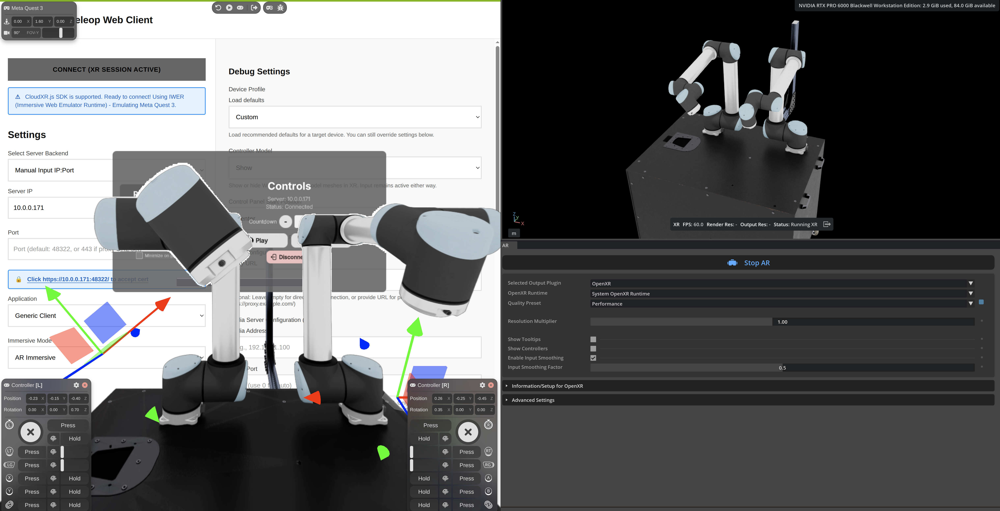
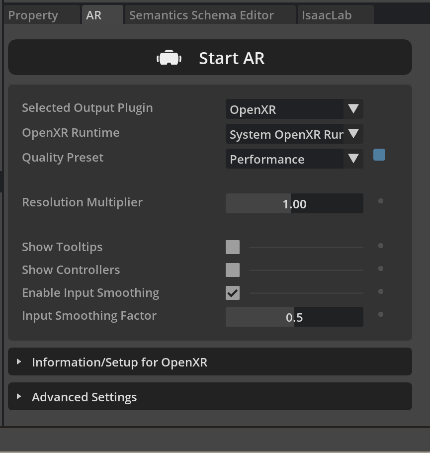
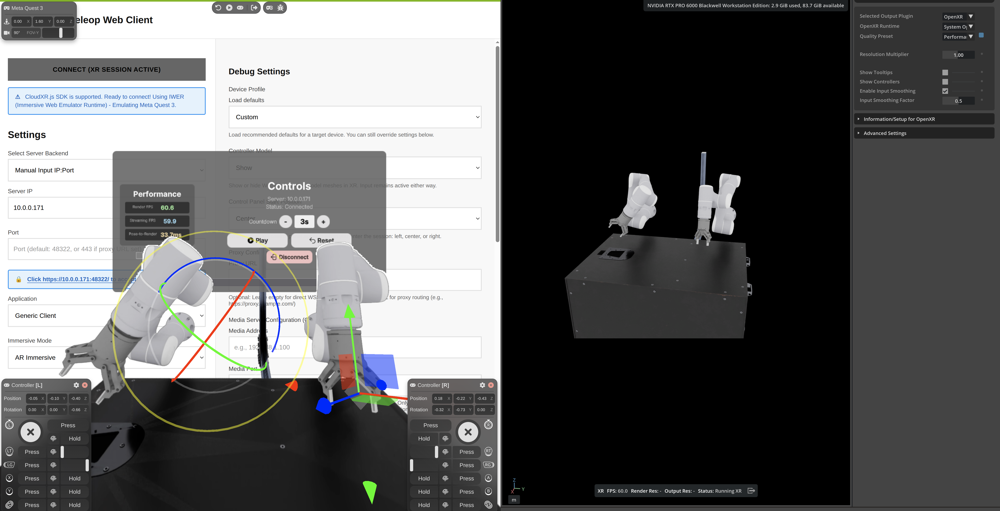

<!--
SPDX-FileCopyrightText: Copyright (c) 2025-2026 NVIDIA CORPORATION & AFFILIATES. All rights reserved.
SPDX-License-Identifier: Apache-2.0
-->

# Bimanual Robot Example using IsaacLab

This directory contains minimal usage examples for teleoperating bimanual robot arms in IsaacLab.

##UR bimanual



## Prerequisites


### 1.Isaac Teleop

Follow [Install Isaac Teleop](https://isaac-sim.github.io/IsaacLab/main/source/how-to/cloudxr_teleoperation.html#cloudxr-teleoperation) to install Isaac Teleop.

After installation, start the ClourXR server:

```bash
python -m isaacteleop.cloudxr
```

### 2.Isaac Lab

Follow [Install Isaac Lab](https://isaac-sim.github.io/IsaacLab/main/source/setup/installation/index.html) to install Isaac Lab with virtual environment `env_isaaclab`.

After installation, activate the virtual environment:

```bash
source <your_isaaclab_path>/env_isaaclab/bin/activate
```

### 3. Install this repository to `env_isaaclab`

```bash
cd examples/isaaclab_bimanual_robot
python -m pip install -e .

## If you use uv:
# uv pip install -e .
```

## How to run

1. Source cloudxr env

```bash
source ~/.cloudxr/run/cloudxr.env
```

2. Run the task

List the two environments:

```bash
python scripts/list_envs.py
```

And you should see:

```
+--------+------------------------------+---------------------------------+-----------------------------------------------------------------------------------------------+
| S. No. | Task Name                    | Entry Point                     | Config                                                                                        |
+--------+------------------------------+---------------------------------+-----------------------------------------------------------------------------------------------+
|   1    | Template-FlexivRizon-Play-v0 | isaaclab.envs:ManagerBasedRLEnv | bimanual.tasks.manager_based.flexiv_rizon.flexiv_rizon_bimanual_env:FlexivRizonBimanualEnvCfg |
|   2    | Template-UR10-Play-v0        | isaaclab.envs:ManagerBasedRLEnv | bimanual.tasks.manager_based.ur10.ur10_bimanual_env:UR10BimanualEnvCfg                        |
+--------+------------------------------+---------------------------------+-----------------------------------------------------------------------------------------------+
```

To examine the task environment only (without XR or Teleop):

```bash
python scripts/zero_agent.py --task Template-UR10-Play-v0 --num_envs=1

python scripts/zero_agent.py --task Template-FlexivRizon-Play-v0 --num_envs=1
```

Teleoperation with XR controllers:

```bash
python scripts/teleop_se3_agent_bimanual_xr.py \
  --task Template-UR10-Play-v0 \
  --teleop_device motion_controllers \
  --num_envs 1 \
  --xr \
  --reverse_rotation_yz

python scripts/teleop_se3_agent_bimanual_xr.py \
  --task Template-FlexivRizon-Play-v0 \
  --teleop_device motion_controllers \
  --num_envs 1 \
  --xr \
  --sensitivity 0.5 \
  --enable_gripper
```

Connect you XR devices before running the task using the [Isaac Teleop Web client](https://nvidia.github.io/IsaacTeleop/client/).


In IsaacLab UI, click the `Start AR` button in the bottom right panel.



Key bindings:
- Press any button on the left controller to start teleoperation
- Move the left controller to control the left arm
- Move the right controller to control the right arm
- Press x or y buttons on the left controller to reset


Record data:

```bash
python scripts/record_se3_agent_bimanual_xr.py \
  --task Template-UR10-Play-v0 \
  --teleop_device motion_controllers \
  --num_envs 1 \
  --xr \
  --dataset_file ./datasets/dataset.hdf5

# or with flexiv rizon
python scripts/record_se3_agent_bimanual_xr.py \
  --task Template-FlexivRizon-Play-v0 \
  --teleop_device motion_controllers \
  --num_envs 1 \
  --xr \
  --sensitivity 0.5 \
  --enable_gripper \
  --dataset_file ./datasets/dataset_flexiv.hdf5
```



Key bindings:
- Press any button on the left controller to start teleoperation
- Move the left controller to control the left arm
- Move the right controller to control the right arm
- Press x or y buttons on the left controller to reset
- Press a or b buttons on the right controller to save the trajectory and reset env

The dataset will be saved to `./datasets/` folder.